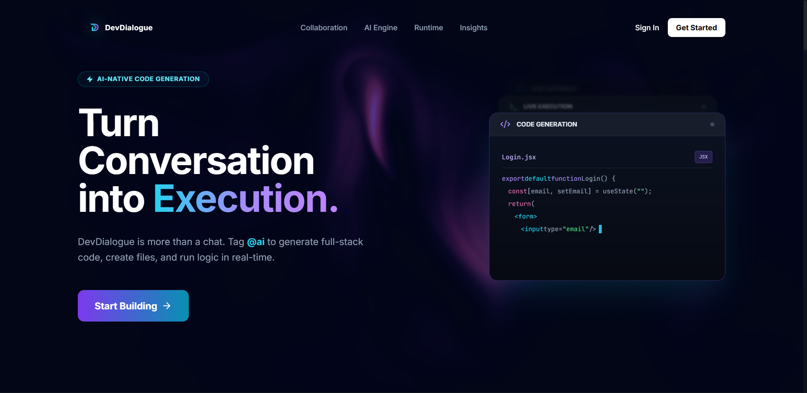
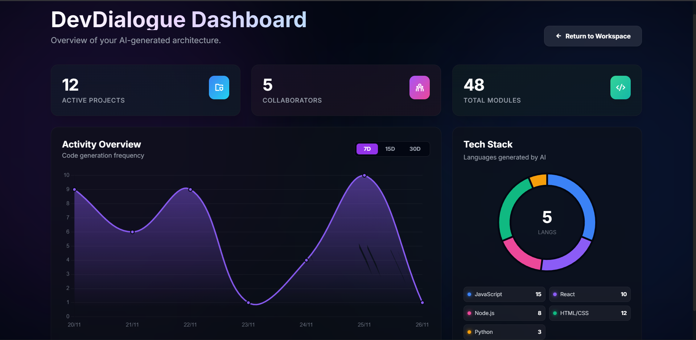
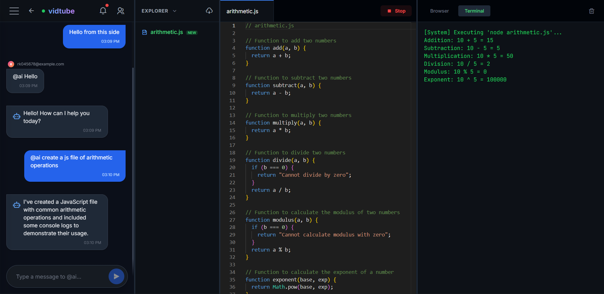

<p align="center">
  
</p>

<h1 align="center">🚀 DevDialogue – The AI-Native Collaborative Cloud IDE</h1>

<p align="center">
  <strong>Run Node.js inside the browser. Build apps with AI. Collaborate in real-time.</strong>
</p>

<p align="center">
  <a href="https://dev-dialogue.vercel.app/">🔗 Live Demo</a> |
  <a href="#-features">✨ Features</a> |
  <a href="#-installation">⚙️ Installation</a>
</p>

<p align="center">
  
  
  
  
  
</p>

---

## 📸 Screenshots

> Actual UI screenshots from the running app

### 🏠 Landing Page


---

### 📌 Main Dashboard


---

### 💬 Home / Workspace UI


---

### 🧑‍💻 IDE Interface (Chat + Code + Terminal)


---

## 🌟 Overview

**DevDialogue** is a next-generation **Cloud IDE** that merges real-time collaboration with **AI-native execution**, powered by **WebContainers** and **Google Gemini 2.0 Flash**.

Unlike traditional editors, DevDialogue runs a **full Node.js runtime inside the browser**, allowing users to:

- Chat with an AI co-developer  
- Scaffold entire applications from one prompt  
- Install packages with `npm install`  
- Run and debug Express server  
- Collaborate live with teammates  

No local environment. No setup. Just open the browser and build.

---

## ❓ Why DevDialogue?

Most online IDEs are just **code editors in the cloud**.  
DevDialogue goes **beyond** that:

| Feature | Other IDEs | DevDialogue |
|--------|-------------|--------------|
| AI-native execution | ❌ | ✅ |
| WebContainers | ❌ | ✅ |
| Full Node.js in browser | ❌ | ✅ |
| Real-time collaboration | ⚠️ Limited | ✅ |
| Folder scaffolding via prompt | ❌ | ✅ |
| Auto fixing package.json | ❌ | ✅ |

It behaves like:

**StackBlitz + ChatGPT + Replit + VS Code Live Share**  
— all inside your browser tab.

---

## 🧠 Key Features

### ⚡ In-Browser Runtime (WebContainers)
- Full Node.js runtime
- `npm install` support
- Auto-detection of project vs single file
- Auto-inject missing `"start"` scripts
- Real terminal output

### 🤖 Context-Aware AI Agent
- Uses **Gemini 2.0 Flash** with file awareness
- Scaffolds entire folder structures
- Reads your active file to fix bugs
- Streaming chat experience (typewriter style)

### 💬 Real-Time Collaboration
- Socket.io messaging
- Online status indicators
- Typing indicators
- Reply & delete features
- Workspace invitations via email

### 🎨 Modern SaaS UI
- Glassmorphism + dark theme
- Framer Motion animations
- Interactive dashboards
- User profiles with avatars

---

## 🏗️ Architecture Diagram

          ┌────────────────────┐
          │    Frontend UI     │
          │  (React + Vite)    │
          └─────────┬──────────┘
                    │
                    │ WebSockets (Socket.io)
                    │ REST APIs
                    ▼
          ┌────────────────────┐
          │     Backend        │
          │ (Express + Node)   │
          └───────┬────────────┘
                  │
                  │ MongoDB (Mongoose)
                  ▼
          ┌────────────────────┐
          │     Database       │
          │   MongoDB Atlas    │
          └────────────────────┘

                      │
                      │ Google Gemini API
                      ▼
            AI-Native Agent Layer

                      │
                      │ WebContainers API
                      ▼
            Full Node.js inside Browser


---

## 🧪 Use Cases

### 👨‍💻 Developer Productivity
- Pair-programming with AI  
- Instant prototyping  
- Refactoring existing code  

### 🧑‍🏫 Education & Workshops
- Teach JavaScript/Node  
- No environment setup  
- Classroom wide IDE  

### 🗨️ Interviews & Collaboration
- Live coding rounds  
- AI assisted debugging  

### 🧱 Rapid Architecture
- Scaffold apps using prompts  
- Generate full boilerplates  

---

## 💬 Prompt Examples

Try these inside the chat:

- Create a full React app using Tailwind with login, routing and context API.
- Fix this Express endpoint, add JWT authentication and refactor to TypeScript.
- Generate a folder structure for a MERN application with clean architecture.
- Explain my code, find bugs and optimize performance.


---

## 🛠️ Tech Stack

| Layer | Technologies |
| --- | --- |
| Frontend | React.js, Vite, Tailwind, Framer Motion, Monaco Editor |
| Backend | Node.js, Express.js, Socket.io |
| Database | MongoDB Atlas |
| AI Engine | Google Gemini API |
| Core Engine | WebContainers API |
| Deployment | Vercel (Frontend), Render (Backend) |


## 🚀 Local Installation

### Prerequisites
- Node.js v18+
- MongoDB (local or Atlas)
- Git

---

### 1️⃣ Clone Repository

```bash
git clone https://github.com/your-username/dev-dialogue.git
cd dev-dialogue
```
### Backend setup 

```bash
cd Backend
npm install
```

### create .env
```bash
PORT=4000
MONGO_URI=your_mongodb_uri
JWT_SECRET=your_secret
GOOGLE_AI_KEY=your_key
REDIS_URL=
```

### Run Backend 

``` bash
npm start
```

### 3️⃣ Frontend Setup

```bash
cd ../Frontend
npm install
```

### Create .env

```bash
VITE_API_URL=http://localhost:4000
```

### Run frontend
``` bash
npm run dev
```

### Visit 👉 http://localhost:5173


🌍 Deployment
Backend (Render)

1. Create Web Service

2. Root Directory → Backend

3. Add env variables

4. Deploy

5. Frontend (Vercel)

6. Create project

7. Root Directory → Frontend

Add:

```bash
VITE_API_URL=https://backend-url.onrender.com
```


### 🔐 Security Notes

1. JWT-based authentication

2. Password hashing (bcrypt)

3. CORS restrictions

4. HTTPS recommended

5. COOP/COEP headers for WebContainers

6. Server rate limiting

### 🗺️ Roadmap

 1. AI multi-file editing

 2. Plugin ecosystem

 3. Export project as Docker

 4. Sync with VSCode

 5. Cloud workspace storage

 6. Live classroom mode

 7. Realtime file diff & merge

### 🤝 Contributing

We ❤️ contributions!

1. Fork repository

2. Create feature branch:
```bash
git checkout -b feature/AmazingFeature
```

3. Commit changes
```bash
git commit -m "Add amazing feature"
```

4. Push
```bash
git push origin feature/AmazingFeature
```

5. Open Pull Request

### 📄 License

Distributed under MIT License.
See LICENSE for details.


### 📬 Contact

Developer: Your Name
LinkedIn: https://linkedin.com/in/your-profile

GitHub: https://github.com/your-username

<p align="center">⭐ If you like the project, give it a star!</p> 

